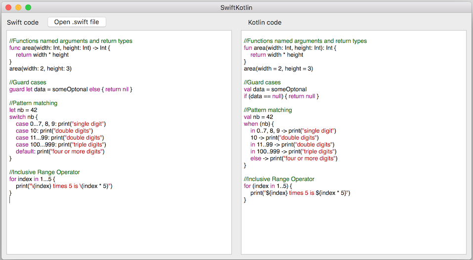

[](https://opensource.org/licenses/MIT)
[](http://twitter.com/angelolloqui)

# SwiftKotlin

A tool to convert Swift code to Kotlin in a very easy and quick way.



# What is this?

SwiftKotlin is a framework, a command line tool and a Mac application for **translating Swift code into Kotlin**.

It applies transformations to the Swift code to get as correct as possible Kotlin code (see limitations below). It does string transformations as well as some more complicated ones like transforming `guard` statements to negative `if` statements, properties, memory management and many others.

It comes with a desktop Mac application to copy & paste your code, as well as a command line tool to transform a complete project to Kotlin.


## Why use SwiftKotlin?

### Why Kotlin?
//TODO:

### Benefits over shared code accross platforms
//TODO: simple, fully native, best tools, platform conventions, no dependency on 3rd parties...


## Limitations
Swift and Kotlin are different languages, with some intrinsic differences in them that can not be fully translated. Besides that, they both run in different environments and have access very different frameworks and system libraries.

Because of that, this **tool does not have as a goal to produce production ready Kotlin code**, but just a Kotlin translation that **will require manual edition**. For example, things as simple as adding a new item to an array has different method names:

```
//Swift 3
array.append("This is in Swift")
```
```
//Kotlin
array.add("This is in Kotlin")
```

The scope of this project is not mapping all existing methods and data types to its Kotlin counterpart, but to translate the language itself. This means that manual editing will be required afterwards, but it is intentional.


## Status
The project is in active development, with many rules still to be implemented. Some of them include:

- [ ] Constructors
- [x] Control flow statments (`guard`, `if`, `for`, `while`, `switch`)
- [ ] Exception handling
- [x] Extensions
- [x] Keyword replacements (`val`, `this`, `fun`, ...)
- [ ] Memory management
- [x] Parameter names
- [x] Property transfromers
- [x] Static to Companion
- [x] Struct to data class
- ...

## Installation
The project comes with 2 executable targets:

- **SwiftKotlinCommandLine**
- **SwiftKotlinApp**

You can download the project and execute them in XCode8+ or just go to the download page to get the most recent compiled versions of the project.

Copy the executables in a directory with executable rights. Typically, you could use:

- swiftkotlin command line tool: `/usr/local/bin/`
- SwiftKotlin desktop app: `/Applications/`

## Usage
### Command line tool
If you placed `swiftkotlin` in your any of your path directories, just run: `swiftkotlin [<file>] [--output path]`

Note that you can specify a directory as input. Output will be default use the input directory, creating a `<name>.kt` file for each existing `<name>.swift` file found. 


## License

MIT licensed.

## Collaboration

Forks, patches and other feedback are always welcome.

//TODO: Contribution guideline


## Credits

SwiftKotlin uses [SwiftFormat](https://github.com/nicklockwood/SwiftFormat/) for extracting tokens from the Swift file.

SwiftKotlin is brought to you by [Angel Garcia Olloqui](http://angelolloqui.com). You can contact me on:

Project Page: [SwiftKotlin](https://github.com/angelolloqui/SwiftKotlin)

Personal webpage: [angelolloqui.com](http://angelolloqui.com)

Twitter: [@angelolloqui](http://twitter.com/angelolloqui)

LinkedIn: [angelolloqui](http://www.linkedin.com/in/angelolloqui)


